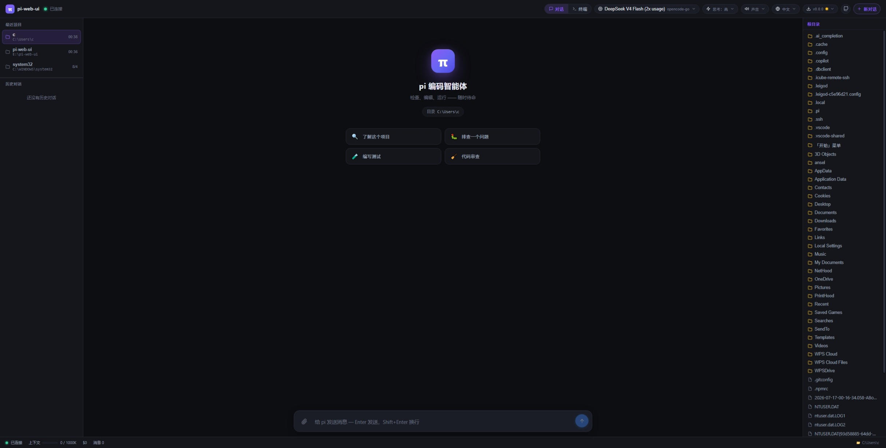

# pi-web-ui

[English](README.md) | **简体中文**

面向 [pi 编码智能体](https://pi.dev) 的 Web 聊天界面，直接构建在
**pi SDK**（[`@earendil-works/pi-coding-agent`](https://www.npmjs.com/package/@earendil-works/pi-coding-agent)）之上——
无子进程、无 JSON-RPC 中间层。智能体运行在服务端进程内，通过 WebSocket 把事件流式推给浏览器。

灵感来自 [Pintra (pi-vsc)](https://github.com/bilalbentoumi/pi-vsc)——它在 VS Code 里通过
`pi --mode rpc` 实现同样的事情。本项目改用 SDK 的 `createAgentSessionRuntime` API 进程内调用
（SDK 文档也推荐 Node.js 应用走这条路而非 RPC），因此有类型安全、直接的状态访问，以及你现有的
pi 认证/配置/扩展——无需额外安装或配置任何东西。

## 功能特性

- 🧠 完整智能体循环：**思考**块（可折叠）+ 流式文本输出
- 🛠 工具执行卡片：**实时输出流**、状态（排队 → 运行中 → 完成/出错）、参数可复制
- 💬 会话**历史按浏览器持久化**（localStorage clientId + 每客户端会话目录）——刷新或重启后聊天记录都在。
  会话面板还会列出当前文件夹下的 pi CLI/TUI 会话（标记为 `TUI`），可以直接从 Web 界面续聊终端对话
- 📂 **项目记忆**：记住每个浏览器上次打开的工作目录（重启后自动恢复），左侧面板有「最近项目」
  列表可一键切换，每个项目的会话独立保存、随时回去接着问
- ✏️ **编辑重问**：每条历史提问下方有编辑按钮，改完从该位置重新提问——服务端 fork 出一个
  新分支会话（该问题之前的历史完整保留），原对话原样留在会话列表，随时可切回
- ⚡ **长对话不卡**：超过 30 条消息后，早期消息自动折叠成摘要行（角色 + 首行预览 + 块计数，
  不渲染 Markdown/思考/工具输出），点击才展开完整内容；最近 15 条始终完整显示
- ⬇️ **一键自更新**：右上角显示当前版本，打开更新面板检查 npm 最新版，发现新版本可一键
  `npm i -g` 升级（更新后需重启服务生效）
- 🔄 模型与思考强度切换（与 pi TUI 一致）、新对话、中止/停止
- 📎 Markdown 渲染：GFM 表格、语法高亮代码块、复制按钮
- 📁 工作区感知：智能体在你指定的目录里读/改/跑代码，使用**你自己的** `~/.pi/agent` 认证、模型、技能和扩展
- 🌐 多个浏览器客户端各自独立会话（每个 clientId 私有会话目录）
- 🖥 内置**终端**（xterm.js + node-pty，无需 VS Code）：三栏布局——左侧**命令列表**
  （用户自定义命令，支持 `${pwd}`，持久化在项目 `.pi/commands.json`）、中间**终端**、
  右侧 VSCode 风格**标签条**支持多个并发 shell。通过顶栏按钮在对话/终端视图间切换。

## 快速开始
## 界面截图



## 快速开始

需要 Node.js ≥ 22.19（pi SDK 的要求；旧版 Node 加载 SDK 时会报 `Unexpected token 'with'`）
以及一个配置好的 pi 安装（先运行一次 `pi` 登录）。

```bash
npm install
npm run dev          # 服务端 :8787，Web UI :5173（自动代理）
# 打开 http://localhost:5173
```

生产模式：

```bash
npm run build        # 编译服务端 (tsc) + 前端 (vite)
npm start            # 在 http://localhost:8787 提供全部服务
```

## npm 包（安装 / 启动 / 停止 / 更新 / 卸载）

包已发布到 npm：[`pi-web-ui`](https://www.npmjs.com/package/pi-web-ui)。

### 安装

```bash
# 全局安装（推荐）
npm i -g pi-web-ui

# 或免安装直接跑（拉取最新版，启动在 :8787）
npx pi-web-ui

# 或安装本地 checkout（发布前测试改动用）
npm i -g .
```

> **npm 由 pi 托管？** 如果你的 `npm` 是拦截依赖安装脚本的 pi 包装器，装完后需要批准一次
> node-pty 的原生构建：`npm approve-scripts node-pty@1.1.0`（标准 npm 会自动完成）。

### 启动

```bash
pi-web-ui                                            # 前台，http://localhost:8787
PORT=9000 PI_WEB_CWD=/path/to/project pi-web-ui      # 自定义端口 / 工作目录
```

想后台运行或开机自启，请使用系统服务——见
[部署与开机自启](#部署与开机自启)（systemd / launchd / Docker）。

`pi-web-ui` 命令从包安装位置提供编译好的前端和 WebSocket API——不需要仓库 checkout。
它使用**你的** `~/.pi/agent` 配置（认证/模型/技能），并把每客户端会话存在
`<PI_WEB_CWD>/.pi-web` 下。

### 停止

- **前台**：在运行它的终端按 `Ctrl+C`。
- **systemd**：`sudo systemctl stop pi-web-ui`
- **launchd**：`launchctl bootout gui/$(id -u)/com.xingshuyin.pi-web-ui`
- **Windows（计划任务）**：`pi-web-ui server stop`（或 `schtasks /End /TN pi-web-ui`；
  停止运行中的实例，自启保留到 `server uninstall` 为止）
- **Docker**：`docker compose stop`（停止并删除容器：`docker compose down`）

（后台进程应该用系统服务管理，而不是 `nohup`——上面的服务停止命令同时会停掉并禁用自启。）

### 验证 / 版本

```bash
pi-web-ui --version     # CLI 版本
npm ls -g pi-web-ui     # 是否已安装？哪个版本？
which pi-web-ui         # 可执行文件位置
```

### 更新

```bash
npm i -g pi-web-ui@latest   # 升级到最新发布版
# 之后重启服务，新版本才会生效
```

### 卸载

```bash
npm uninstall -g pi-web-ui
```

卸载**不会**删除你的聊天记录：会话数据存放在 `<PI_WEB_CWD>/.pi-web`
（或 `PI_WEB_DATA_DIR`），卸载/升级后依然保留。

### 作为系统服务管理（开机自启）

把服务端安装为开机自启的系统服务，可自定义端口和工作目录：

```bash
pi-web-ui server install --port 9000 --cwd /path/to/project   # 安装并启动
pi-web-ui server status                # 运行中？自启？
pi-web-ui server restart               # 重启（配置变更后同样用它）
pi-web-ui server stop                  # 停止 + 禁用自启
pi-web-ui server start                 # 重新启动
pi-web-ui server uninstall             # 彻底移除服务
```

- **macOS** → launchd 代理（无需 sudo）：写入并加载
  `~/Library/LaunchAgents/com.xingshuyin.pi-web-ui.plist`，崩溃自动重启
  （`KeepAlive`），日志在 `/tmp/pi-web-ui.log` / `/tmp/pi-web-ui.err`。
- **Linux** → systemd 单元（自动 sudo）：写入
  `/etc/systemd/system/pi-web-ui.service` 并执行 `systemctl enable --now`，
  日志用 `journalctl -u pi-web-ui -f` 查看。
- **Windows** → 任务计划程序：创建登录时启动的用户任务（与 launchd 代理一致；
  通常不需要管理员，但部分机器上 `schtasks /Create` 需要提权的 PowerShell——
  如果 `install` 报 `ERROR: Access is denied`，请用管理员 shell 重跑）。任务通过
  `powershell.exe -WindowStyle Hidden` 运行生成在 `%APPDATA%\pi-web-ui\pi-web-ui.ps1`
  的 PowerShell 启动器——**不会有黑色控制台窗口**常驻，没有可被误关/误杀的东西。
  启动器设置环境变量、cd 到工作目录、启动 node，并把日志追加到
  `%USERPROFILE%\pi-web-ui.log`。任务 XML 保存在旁边；失败会自动重启。
  **务必显式传 `--cwd`**——任务会继承安装时 shell 的目录，而管理员 shell 默认是
  `C:\WINDOWS\system32`，非提权任务写不进去（启动即 EPERM）。详见
  [Windows — 任务计划程序](#windows--任务计划程序)。
- 选项：`--port`（默认 8787 或 `$PORT`）、`--cwd`（默认 `$PI_WEB_CWD` 或当前目录）、
  `--data-dir`（会话目录）、`--name`（自定义服务名；macOS 标签为
  `com.xingshuyin.pi-web-ui`，自定义名变成 `com.<name>.server`）。`--print` 预览
  生成的 unit/plist/任务文件而不实际应用。
- 用新参数重跑 `install` 会重新生成配置并重启服务——这就是修改已装服务端口/cwd 的方式。

## 配置

| 环境变量                   | 默认值            | 说明                                                                                                                   |
| -------------------------- | ----------------- | ---------------------------------------------------------------------------------------------------------------------- |
| `PORT`                   | `8787`          | HTTP/WebSocket 端口                                                                                                    |
| `PI_WEB_CWD`             | 服务端 cwd        | 智能体操作的工作区目录（读/编辑/bash/写）                                                                              |
| `PI_WEB_DATA_DIR`        | `<cwd>/.pi-web` | 每客户端会话目录的存放位置                                                                                             |
| `PI_WEB_INLINE_FILE_MAX` | `12288` (12KB)  | 小于等于该大小的文本附件直接内联进模型上下文；更大的文件以路径引用方式传入，模型按需用 read 工具读取（小改动省 token） |
| `PI_CODING_AGENT_DIR`    | `~/.pi/agent`   | pi 配置目录（auth.json、models.json、skills、extensions）                                                              |

示例——让智能体面向某个项目：

```bash
PI_WEB_CWD=/path/to/your/project npm run dev
```

## 架构

```text
Browser (React + Vite)
   │  WebSocket JSON — 快照驱动协议 (server/protocol.ts)
   ▼
server/index.ts        express 静态 + ws 端点
   │
server/agent-service.ts   每客户端 ClientSession:
   │   createAgentSessionRuntime({ sessionManager: SessionManager.continueRecent(cwd, sessionDir) })
   │   session.subscribe(events) → 节流全量快照 + 实时工具增量
   ▼
@earendil-works/pi-coding-agent (SDK, 进程内)
   │   ModelRuntime (auth 来自 ~/.pi/agent) · tools · extensions · skills
   ▼
   你的 LLM 提供商
```

关键设计点：

- **快照驱动 UI。** 服务端是唯一事实源：每次 SDK 事件后调度一个节流（60 ms）的全量快照，
  浏览器纯粹按快照渲染。重连只需重新请求 `get_state`。大载荷（工具输出、文本）在序列化时
  做了截断（`server/serialize.ts`）。
- **助手实时流式输出。** 进行中的消息（SDK `agent.state.streamingMessage`）被序列化进每个快照，
  所以思考块和回答文本是**边生成边**出现在浏览器里（带闪烁光标），而不是等整轮结束才显示。
  部分消息拿到稳定的 `stream-<ts>` id，跨快照保持挂载（展开的思考/工具块状态不丢）。
- **按大小感知的附件。** 点击 + 把文件加入附件队列（显示在输入框上方的 chips）。发送时服务端
  把每个文件作为独立的 custom message 附加（SDK `sendCustomMessage` + `nextTurn` asides）——
  用户消息保持干净，每个文件渲染成自己可折叠的卡片：小文本文件（≤ `PI_WEB_INLINE_FILE_MAX`，
  默认 12KB）直接内联，模型立即看到；更大的文件以 `<file path=...>` 引用传入，模型按需用
  `read` 工具读取——所以附加一个 5 MB 的文件在模型真正查看前只花几个 token。图片始终以
  image content 附加。
- **图片问答。** 除了从右侧文件树附加工作区图片，还可以**直接粘贴截图（Ctrl+V）、把图片拖到
  输入框、或点输入框的 🖼 按钮上传**——浏览器先把图片等比缩到 ≤1568px 再编码，图片随消息
  发送（`prompt.attachments[].imageData` base64），无需存在于工作区。当前模型不支持识图时
  会提示；非识图模型看不到图片。
- **文件对话。** 任意本地文件（文本/二进制）也可以直接**拖入输入框或用 📎 按钮上传**——浏览器
  把内容以 base64 发送（`prompt.attachments[].fileData`），服务端存到 `~/.pi-web/uploads/<clientId>/`
  并作为附件附加：小文本文件直接内联给模型看，大文件/二进制以绝对路径引用（模型的 read 工具
  支持绝对路径，可按需读取）；上限 20MB。
- **带行号选区的文件预览。** 在右侧面板点击文件名（或其 👁 按钮）打开带行号的预览弹窗。
  点击 / 拖拽 / Shift+点击选择行区间，然后点"添加到对话"把它作为 `lines` 附件入队——
  服务端只内联选中的区间（`<file path=... lines="2-3">`），可以精确指向想说的代码而不必
  倾倒整个文件。预览读取上限 512 KB，二进制文件会被检测并拒绝。
- **实时工具输出。** `bash_execution_update` / `tool_execution_update` 事件被转发为轻量
  `tool_delta` 消息，终端输出实时流动；最终输出在下一个快照的 toolResult 消息里到达，取代
  delta 缓冲。
- **隔离会话。** 每个浏览器客户端在数据目录下拥有 `sessions/<clientId>/`，重连时通过
  `SessionManager.continueRecent` 续接。
- **你已经拥有的一切。** 无需单独认证步骤——SDK 读取 `~/.pi/agent/auth.json` 并自动加载
  你的全局扩展/技能。

## 终端

从顶栏切换终端视图（对话/终端）。它以三栏布局替代聊天界面：

- **左 — 命令**：点击命令在对应目录打开终端标签页并运行。可在面板里增/改/删命令；它们保存到
  `<project>/.pi/commands.json`（提交进仓库，与队友共享）：

  ```json
  {
    "commands": [
      { "name": "dev", "command": "npm run dev", "cwd": "${pwd}" },
      { "name": "test", "command": "npm test", "cwd": "${pwd}/server" },
      { "name": "build", "command": "npm run build", "cwd": "~/other-project" }
    ]
  }
  ```

  `${pwd}` 解析为智能体当前工作目录（聊天视图文件面板里显示的那个，可用 set_cwd 修改）；
  `~` 和相对路径同样有效。命令面板顶部的 `+` 按钮新建条目。
- **中 — 终端**：每个标签页是一个真实 PTY（macOS/Linux 是你的 `$SHELL`；Windows 是
  PowerShell 或 cmd.exe——`$COMSPEC`）；输出实时流动，可以输入、Ctrl+C、调整大小等，和桌面
  终端一模一样。Windows 上的 Git Bash 用户会自动拿到 `$SHELL`。
- **右 — 终端（标签）**：VSCode 风格纵向标签条。`+` 在当前目录打开一个普通 shell。
  关闭标签页会杀掉它的进程。

说明：

- 切回聊天视图时，运行中的命令继续运行。
- 客户端的最后一个浏览器标签断开时终端会被杀掉（不留孤儿 dev server），所以断线会重置终端视图。

## 协议

完整 wire 格式见 `server/protocol.ts`。客户端 → 服务端：`hello`、`prompt`、`abort`、
`new_chat`、`cycle_model`、`cycle_thinking`、`get_state`、`list_sessions`、
`switch_session`、`list_files`、`list_models`、`set_model`、`set_thinking`、`set_cwd`、
`complete_path`、`dialog_response`、`terminal_create`、`terminal_input`、
`terminal_resize`、`terminal_kill`、`run_command`、`list_commands`、`save_commands`。
服务端 → 客户端：`ready`、`snapshot`（完整 `UiState`）、`tool_delta`、`notice`、
`terminal_output`、`terminal_exit`、`commands`。

## 脚本

| 脚本                               | 作用                                           |
| ---------------------------------- | ---------------------------------------------- |
| `npm run dev`                    | 服务端（tsx watch）+ Vite dev server + WS 代理 |
| `npm run build`                  | 类型检查 + 构建前端和服务端                    |
| `npm start`                      | 运行生产服务端（提供`web/dist`）             |
| `npm run typecheck`              | 双端`tsc --noEmit`                           |
| `node terminal-smoke-test.mjs`   | WS 层终端/命令协议测试（先 build）             |
| `node terminal-browser-test.mjs` | 终端视图的无头浏览器 E2E（先 build）           |

## 部署与开机自启

最快的路径：`pi-web-ui server install --port 8787 --cwd /path`——安装并让服务开机自启
（见[作为系统服务管理（开机自启）](#作为系统服务管理开机自启)）。
下面的手动方案保留给参考 / 非标准场景。

### Docker（一条命令）

```bash
docker compose up -d     # 构建，启动在 :8787，开机自动重启
docker compose stop      # 停止（保留容器）
docker compose down      # 停止并删除容器
```

`docker-compose.yml` 里的 `restart: unless-stopped` 让 Docker 守护进程启动时（开机、崩溃、
重启）把服务拉起来。挂载一个卷给 `/app/.pi-web`（会话持久化），可选地挂载你的 `~/.pi/agent`
配置和工作区——见 `docker-compose.yml` 里的注释。

### Linux — systemd

```bash
sudo npm i -g pi-web-ui
sudo cp deploy/pi-web-ui.service /etc/systemd/system/
# 先编辑 unit 里的 User/WorkingDirectory/Environment
sudo systemctl daemon-reload
sudo systemctl enable --now pi-web-ui     # 立即启动 + 每次开机启动
sudo systemctl stop pi-web-ui             # 停止
sudo systemctl disable pi-web-ui          # 取消开机自启
journalctl -u pi-web-ui -f                # 日志
```

### macOS — launchd

```bash
npm i -g pi-web-ui
cp deploy/com.xingshuyin.pi-web-ui.plist ~/Library/LaunchAgents/
# 编辑 ProgramArguments / WorkingDirectory / PI_WEB_CWD（which pi-web-ui）
launchctl bootstrap gui/$(id -u) ~/Library/LaunchAgents/com.xingshuyin.pi-web-ui.plist
launchctl bootout gui/$(id -u)/com.xingshuyin.pi-web-ui   # 停止 + 移除自启
# 日志：/tmp/pi-web-ui.log、/tmp/pi-web-ui.err
```

### Windows — 任务计划程序

最简路径（自动生成一切，无需手改 XML）：

```bat
npm i -g pi-web-ui
pi-web-ui server install --port 8787 --cwd C:\path\to\project
pi-web-ui server status
pi-web-ui server restart
pi-web-ui server stop        :: 停止运行中的实例（自启保留）
pi-web-ui server uninstall   :: 彻底移除任务
```

它的做法：写入 `%APPDATA%\pi-web-ui\pi-web-ui.ps1`（一个 PowerShell 启动器：设置
`PORT`/`PI_WEB_CWD`、cd 到工作目录、启动 node 并把输出追加到 `%USERPROFILE%\pi-web-ui.log`）
和任务计划程序 XML，然后注册一个**登录时**任务（`schtasks /Create /XML`——你登录时运行，
与 launchd 代理一致；通常不需要管理员，但如果遇到拒绝访问，请看下面的排障说明）。任务调用
`powershell.exe -WindowStyle Hidden`，所以服务运行**没有黑色控制台窗口**——没有可被误关/误杀
的东西。不实际安装即可预览两个生成文件：`pi-web-ui server install --print`。

手工方案用 `deploy/pi-web-ui-task.xml`：改好路径，把文件存成 **UTF-16 LE**（schtasks 要求），
然后 `schtasks /Create /TN "pi-web-ui" /XML pi-web-ui-task.xml /F` 和
`schtasks /Run /TN "pi-web-ui"`。

> **Windows 排障**
>
> - **`install` 报 `ERROR: Access is denied`（错误: 拒绝访问）**——部分机器上任务计划程序
>   不允许非提权令牌创建任务（删除自己拥有的任务 `schtasks /Delete` 却可以，所以
>   `server uninstall` 正常）。解决：在**管理员（提权）PowerShell** 里执行
>   `pi-web-ui server install`。
> - **务必显式传 `--cwd`，且指向用户可写目录。** 任务会继承安装时 shell 的当前目录作为
>   工作目录。从提权 shell 安装且不带 `--cwd` 时，任务会注册成 `C:\WINDOWS\system32`，
>   服务端启动时随即报
>   `EPERM: operation not permitted, mkdir 'C:\WINDOWS\system32\.pi-web\sessions\...'`
>   ——因为登录任务以最小权限令牌运行，无法在 `system32` 下写入。请用例如
>   `--cwd C:\Users\<you>`（会话随之存到 `C:\Users\<you>\.pi-web`）。
> - **修复已装坏的任务**（目录注册错的任务）：`pi-web-ui server uninstall`，然后
>   在提权 shell 里 `pi-web-ui server install --cwd C:\Users\<you>`。
>   用新选项重跑 `install` 也会就地重新生成任务。
>
> **不登录也要开机启动？** 登录任务需要交互式会话，与 launchd 代理一样。
> 无头/常开 Windows 请用 Docker（见上）。

三套模板分别使用 `KeepAlive` / `Restart=on-failure` / `RestartOnFailure`，服务崩溃后
自动重启，并在登录/开机时自动启动。

## License

MIT
